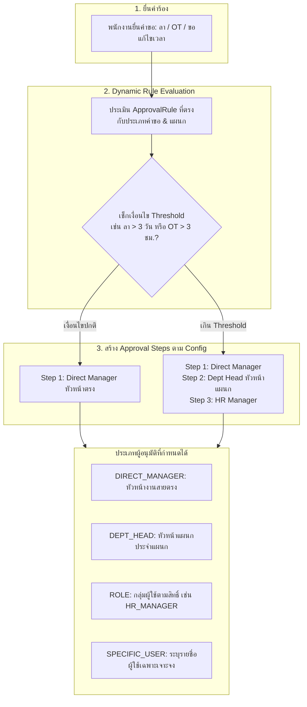
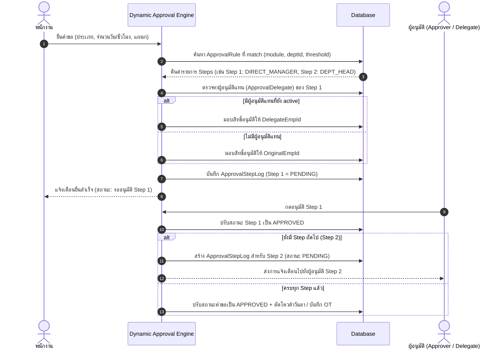
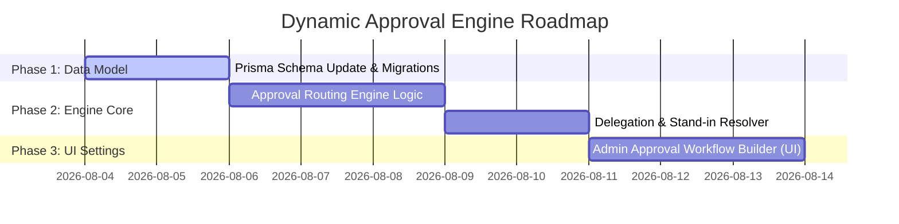

# ⚙️ HRIS Dynamic & Flexible Approval Engine Specification

**System Name:** PS-Trading Enterprise HRIS (v2.0)  
**Document Type:** Flexible Approval Engine Architecture, Data Model & Workflow Design  
**Date:** August 3, 2026  

---

## 📑 1. Architectural Concept

ระบบ **Dynamic Approval Engine** ได้รับการออกแบบมาเพื่อแก้ปัญหาการยึดติดกับสายการอนุมัติแบบเปิดปิดตายตัว (Hardcoded 2-Step) โดยรองรับการกำหนดเงื่อนไขแบบยืดหยุ่น (Configurable Matrix) ตามประเภทคำร้อง, แผนก, ตำแหน่ง, จำนวนวัน/ชั่วโมง, และผู้ปฏิบัติหน้าที่แทน



---

## 🗄️ 2. Database Schema Design (Prisma ORM Extension)

```prisma
// 1. ตารางแม่กำหนดกฎสายการอนุมัติ (Approval Rules)
model ApprovalRule {
  id            Int            @id @default(autoincrement())
  module        String         // LEAVE, OT, CORRECTION, HEADCOUNT, EXPENSE
  name          String         // เช่น "กฎการอนุมัติวันลาพักร้อนเกิน 3 วัน"
  deptId        Int?           // ผูกกับแผนก (null = ใช้กับทุกแผนก)
  employeeType  String?        // FULL_TIME, CONTRACT, PROBATION
  minThreshold  Float?         // เช่น 0 (สำหรับ 0 วันขึ้นไป)
  maxThreshold  Float?         // เช่น 3 (สำหรับไม่เกิน 3 วัน)
  isActive      Boolean        @default(true)
  priority      Int            @default(1) // Priority ในการแมตช์กฎ
  steps         ApprovalRuleStep[]
  createdAt     DateTime       @default(now())
  updatedAt     DateTime       @updatedAt

  @@index([module, deptId, isActive])
}

// 2. ตารางลูกกำหนดลำดับผู้อนุมัติแต่ละลำดับ (Approval Rule Steps)
model ApprovalRuleStep {
  id             Int          @id @default(autoincrement())
  approvalRuleId Int
  approvalRule   ApprovalRule @relation(fields: [approvalRuleId], references: [id], onDelete: Cascade)
  stepNumber     Int          // ลำดับที่ 1, 2, 3...
  approverType   String       // DIRECT_MANAGER, DEPT_HEAD, ROLE, SPECIFIC_USER
  targetRoleId   Int?         // กรณี approverType == 'ROLE'
  specificEmpId  Int?         // กรณี approverType == 'SPECIFIC_USER'
  autoApproveMins Int?        // กรณี Timeout ให้ Auto Approve (เช่น 2880 นาที = 48 ชม.)
  requireReason  Boolean      @default(true)

  @@unique([approvalRuleId, stepNumber])
}

// 3. ตารางบันทึกสถานะการอนุมัติแต่ละลำดับจริง (Approval Log Chain)
model ApprovalStepLog {
  id               Int             @id @default(autoincrement())
  approvalRequestId Int
  approvalRequest  ApprovalRequest @relation(fields: [approvalRequestId], references: [id], onDelete: Cascade)
  stepNumber       Int
  approverEmpId    Int             // ผู้มีสิทธิ์อนุมัติจริงใน Step นี้
  actualApprovedBy Int?            // พนักงานที่มากดอนุมัติจริง (กรณีมีผู้อนุมัติแทน)
  status           String          // PENDING, APPROVED, REJECTED, SKIPPED
  comment          String?
  actionAt         DateTime?
  createdAt        DateTime        @default(now())
}

// 4. ตารางกำหนดผู้อนุมัติแทน (Delegate / Stand-in Approver)
model ApprovalDelegate {
  id             Int      @id @default(autoincrement())
  originalEmpId  Int      // ผู้มอบอำนาจ (เช่น Manager ที่ไม่อยู่)
  delegateEmpId  Int      // ผู้รับมอบอำนาจอนุมัติแทน
  startDate      DateTime // วันที่เริ่มมอบอำนาจ
  endDate        DateTime // วันที่สิ้นสุด
  reason         String?  // เหตุผล เช่น ลาพักร้อนต่างประเทศ
  isActive       Boolean  @default(true)

  @@index([originalEmpId, startDate, endDate])
}
```

---

## ⚙️ 3. Execution Algorithm (การทำงานของ Engine)



---

## 🎨 4. Configuration Capabilities (คุณสมบัติความยืดหยุ่นที่แอดมินตั้งค่าได้)

1. **การกำหนดเงื่อนไขแบบแยกตามแผนก (Department-Specific Flows)**:
   - ฝ่ายผลิต (Factory): ต้องการ 3 ขั้นตอน (Supervisor -> Dept Head -> Factory Director)
   - ฝ่าย IT/Office: ต้องการเพียง 1 ขั้นตอน (Direct Manager อนุมัติจบ)
2. **การกำหนด Threshold ลา/OT (Value-Based Escalation)**:
   - ลาป่วย 1-2 วัน: Direct Manager อนุมัติจบ
   - ลาป่วย >= 3 วัน: ต้องแนบใบรับรองแพทย์ + เพิ่มขั้นตอน HR Manager อนุมัติร่วม
3. **การตั้งค่าอนุมัติแทนอัตโนมัติ (Delegation & Out-of-Office Rule)**:
   - เมื่อ Manager ลาพักร้อน สามารถตั้งค่าให้ Supervisor หรือ HR อนุมัติแทนในช่วงวันที่กำหนดได้
4. **Auto-Escalation & Timeout**:
   - หากผู้อนุมัติไม่ดำเนินการภายใน 48 ชั่วโมง ระบบส่งแจ้งเตือนเตือนความจำ หรือเลื่อนระดับขึ้นไปยังผู้จัดการระดับสูงกว่าโดยอัตโนมัติ

---

## 🚀 5. Roadmap & Implementation Plan



---
*เอกสารออกแบบสถาปัตยกรรมระบบอนุมัติแบบยืดหยุ่น (Dynamic & Flexible Approval Engine Specification) สำหรับ PS-Trading Enterprise HRIS v2.0*
