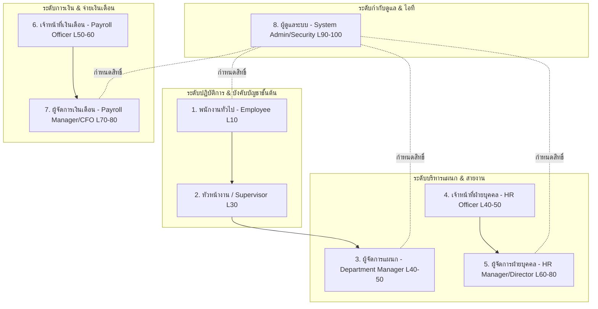
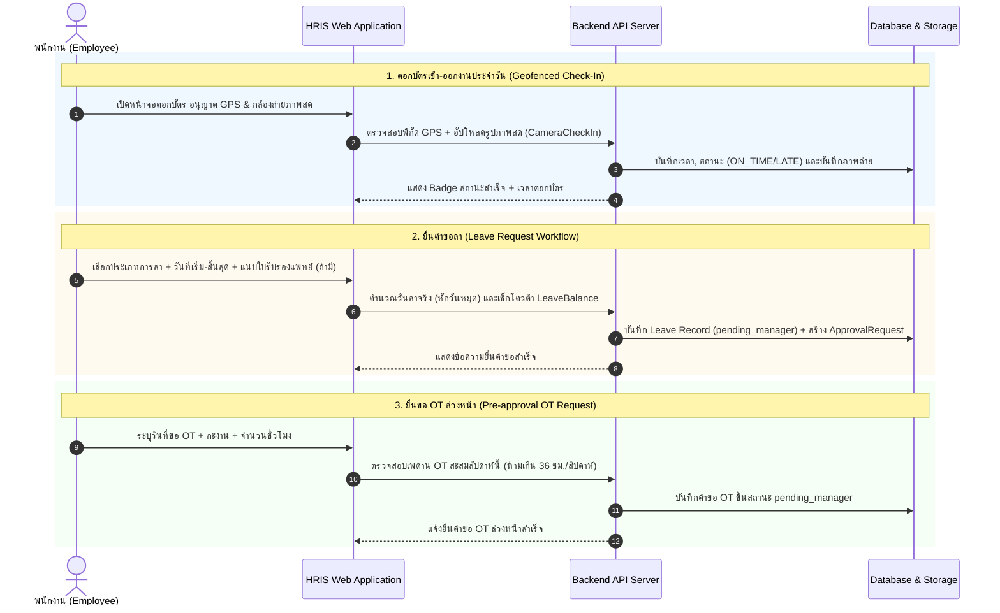
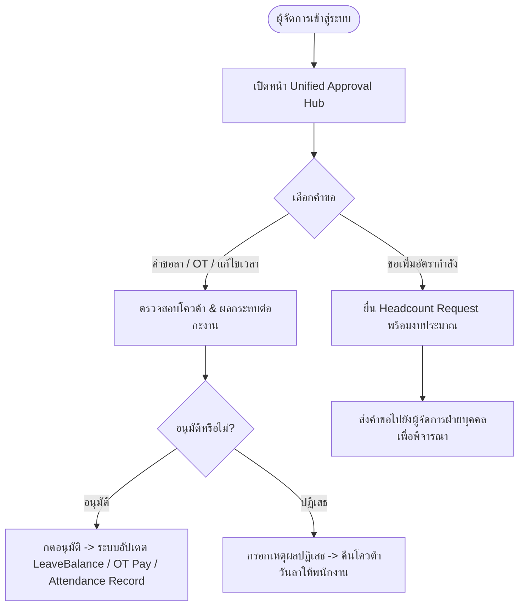
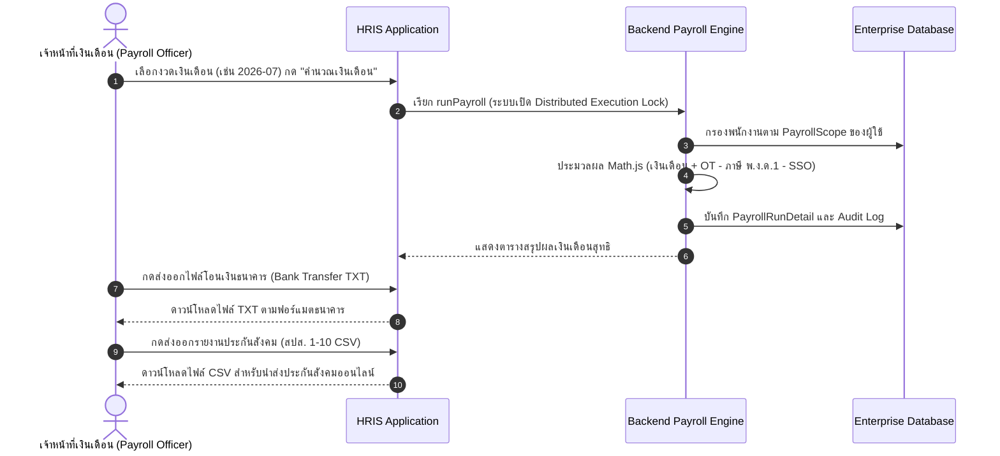

# 🔄 HRIS Enterprise — Real-World End-to-End Operational Workflows Specification

**System Name:** PS-Trading Enterprise HRIS (v2.0)  
**Document Type:** Role-Based Operational Workflow & Standard Operating Procedure (SOP) Specification  
**Date:** August 3, 2026  

---

## 📑 1. Overview of Organizational Roles

---

## 📝 2. Role-Based End-to-End Workflows

---

### 👤 Role 1: พนักงานทั่วไป (Employee / Operational Staff - Level 10)

#### **เวิร์กโฟลว์ประจำวันและการยื่นคำร้อง (Daily Routine & Self-Service Workflow)**

---

### 👔 Role 2: หัวหน้างาน / ซูเปอร์ไวเซอร์ (Team Leader / Supervisor - Level 30)

#### **เวิร์กโฟลว์กำกับดูแลทีมอนุมัติชั้นที่ 1 (First-line Team Supervision Workflow)**
1. **ติดตามการลงเวลาของลูกทีมประจำวัน (Daily Team Monitoring)**:
   - เข้าสู่ระบบดูหน้า Dashboard สรุปจำนวนทีมงานที่มาตรงเวลา, มาสาย (`LATE`), หรือยังไม่ตอกบัตร
2. **กลั่นกรองคำขอชั้นแรก (Step 1 Initial Verification)**:
   - ตรวจสอบคำขอลา / OT / ขอแก้ไขเวลา ของลูกทีมในสังกัด
   - หากเห็นชอบ: ส่งต่อคำขอขึ้นสถานะ `pending_manager` เพื่อให้ผู้จัดการอนุมัติขั้นสุดท้าย
   - หากไม่เห็นชอบ: กดปฏิเสธพร้อมระบุเหตุผลชัดเจน

---

### 🏢 Role 3: ผู้จัดการแผนก (Department Manager - Level 40-50)

#### **เวิร์กโฟลว์อนุมัติขั้นสุดท้ายและการบริหารอัตรากำลัง (Department Approval & Headcount Workflow)**

---

### 📋 Role 4: เจ้าหน้าที่ฝ่ายบุคคล / สรรหา (HR Officer - Level 40-50)

#### **เวิร์กโฟลว์การบริหารข้อมูลพนักงานและวันหยุด (Employee Master Data & Attendance Audit Workflow)**
1. **การบันทึกพนักงานใหม่ (Employee Onboarding)**:
   - บันทึกประวัติพนักงาน, กำหนดประเภทพนักงาน (`EmployeeType`), กะงานประจำ (`Shift`), เลขบัญชีธนาคาร, เลขประกันสังคม, และ Tax ID
2. **การจัดการวันหยุดและนโยบายการลา (Calendar & Leave Policy Management)**:
   - กำหนดวันหยุดนักขัตฤกษ์ประจำปี (`PublicHoliday`) และตั้งค่านโยบายสิทธิ์การลาตามอายุงาน
3. **การตรวจสอบความถูกต้องของการลงเวลาก่อนตัดวิก (Pre-Payroll Attendance Audit)**:
   - ตรวจสอบและอนุมัติคำขอแก้ไขเวลาลงงานย้อนหลัง
   - ส่งออกรายงานการลงเวลาและการลาเป็นไฟล์ Excel (`export/excel`) เพื่อส่งต่อให้ฝ่ายเงินเดือน

---

### 👑 Role 5: ผู้จัดการฝ่ายบุคคล / ผู้อำนวยการ HR (HR Manager/Director - Level 60-80)

#### **เวิร์กโฟลว์การบริหารโครงสร้างองค์กร นโยบาย และอนุมัติ Headcount (HR Executive Workflow)**
1. **การบริหารโครงสร้างองค์กร (Organization Subtree Hierarchy)**:
   - กำหนดโครงสร้าง Region -> Branch -> Department และกำหนดตำแหน่งงาน (`Position`)
   - บริหารจัดการ Smart Delete ป้องกันการลบแผนกที่มีพนักงานผูกอยู่
2. **การอนุมัติ Headcount & Job Requisitions**:
   - พิจารณาอนุมัติคำขอเพิ่มอัตรากำลังจากผู้จัดการแผนกตามกรอบงบประมาณ
3. **การกำหนดนโยบายระบบ (System Policy Control)**:
   - กำหนดเงื่อนไขประกันสังคม (SSO Cap 750 THB), อัตราคูณ OT, และวิธีการคำนวณภาษีเงินได้

---

### 💸 Role 6: เจ้าหน้าที่ฝ่ายจ่ายเงินเดือน (Payroll Officer / Specialist - Level 50-60)

#### **เวิร์กโฟลว์คำนวณเงินเดือนและออกไฟล์โอนเงิน (Payroll Computation & Export Workflow)**

---

### 📑 Role 7: ผู้จัดการฝ่ายเงินเดือน / ผู้อำนวยการการเงิน (Payroll Manager / CFO - Level 70-80)

#### **เวิร์กโฟลว์ตรวจสอบ Audit Trail และอนุมัติจ่ายเงินเดือน (Payroll Audit & Final Approval Workflow)**
1. **การตรวจสอบ Audit Log เงินเดือน (Payroll Audit Inspection)**:
   - ตรวจสอบรายการโอนเงิน, ภาษีหัก ณ ที่จ่าย และเงินสมทบประกันสังคมสะสม
   - ตรวจสอบ `EnterpriseAuditLog` พร้อม Cryptographic SHA-256 Hash เพื่อยืนยันว่าไม่มีการแก้ไขยอดเงินโดยมิชอบ
2. **การอนุมัติจ่ายเงินเดือนขั้นสุดท้าย (Final Payroll Approval)**:
   - ปรับสถานะงวดเงินเดือนจาก `draft` เป็น `approved`
   - ระบบเปิดให้พนักงานดาวน์โหลดสลิปเงินเดือนรูปแบบ PDF ได้ทันที

---

### 🛡️ Role 8: ผู้ดูแลระบบ / เจ้าหน้าที่ความปลอดภัย (System Admin / Security Officer - Level 90-100)

#### **เวิร์กโฟลว์การบริหารสิทธิ์ RBAC และความปลอดภัยระบบ (System Administration & Security Governance)**
1. **การกำหนดสิทธิ์การใช้งาน (RBAC & AuthGroup Setup)**:
   - กำหนด Role, Permission, และผูก DataScope / PayrollScope ให้ผู้ใช้งานแต่ละท่าน
2. **การตั้งค่าพิกัด Geofence และกฎการมาสาย**:
   - ปรับตั้งค่า ละติจูด/ลองจิจูด ของบริษัท, ระยะรัศมีตอกบัตรที่อนุญาต (`allowedRadiusM`) และระยะเวลาอนุโลมสาย (`lateThresholdMins`)
3. **การกำกับดูแลความปลอดภัย (Session Security & Audit)**:
   - ตรวจสอบการยกเลิก Token (JWT Blacklist) และสุ่มตรวจความถูกต้องของ Audit Logs ในระบบ

---

## 📊 3. Operational Matrix by Role & Permission Summary

| บทบาท (Role) | ตอกบัตร / ยื่นลา / OT | อนุมัติวันลา / OT | บริหารองค์กร / พนักงาน | คำนวณเงินเดือน | ส่งออกไฟล์ธนาคาร / สปส. | อนุมัติเงินเดือนสุทธิ | กำหนดสิทธิ์ RBAC / Geofence |
| :--- | :---: | :---: | :---: | :---: | :---: | :---: | :---: |
| **พนักงานทั่วไป** | ✅ (เฉพาะตนเอง) | ❌ | ❌ | ❌ | ❌ | ❌ | ❌ |
| **หัวหน้างาน** | ✅ (เฉพาะตนเอง) | 🟡 (กลั่นกรอง ชั้นที่ 1) | ❌ | ❌ | ❌ | ❌ | ❌ |
| **ผู้จัดการแผนก** | ✅ (เฉพาะตนเอง) | ✅ (อนุมัติในแผนก) | 🟡 (ยื่น Headcount) | ❌ | ❌ | ❌ | ❌ |
| **เจ้าหน้าที่ HR** | ✅ | ✅ | ✅ | ❌ | ❌ | ❌ | ❌ |
| **ผู้จัดการ HR** | ✅ | ✅ | ✅ (สิทธิ์เต็ม) | ❌ | ❌ | ❌ | ❌ |
| **เจ้าหน้าที่เงินเดือน** | ✅ | ❌ | ❌ | ✅ (ตาม Scope) | ✅ | ❌ | ❌ |
| **ผู้จัดการเงินเดือน** | ✅ | ❌ | ❌ | ✅ | ✅ | ✅ | ❌ |
| **System Admin** | ✅ | ✅ | ✅ | ✅ | ✅ | ✅ | ✅ |

---
*เอกสารข้อกำหนดขั้นตอนการทำงานจริง (Standard Operating Procedures - SOP) สำหรับระบบ PS-Trading Enterprise HRIS v2.0*
