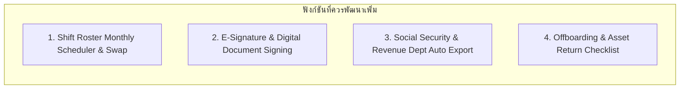
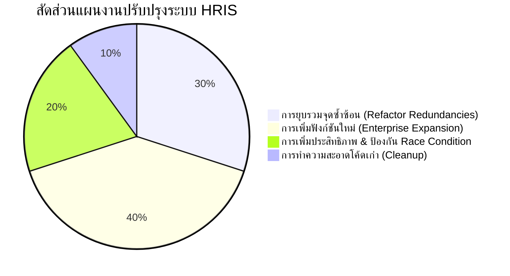

# 🔍 HRIS Enterprise System Architecture & Functional Optimization Audit

**System Name:** PS-Trading Enterprise HRIS (v2.0)  
**Document Type:** Functional Redundancy, Utility, Refinement & Enhancement Audit  
**Date:** August 3, 2026  
**Auditor:** Chief Software Architect & Enterprise HRIS Consultant  

---

## 📑 Executive Summary

จากการวิเคราะห์สถาปัตยกรรมระบบ, โครงสร้าง API Endpoints, ซอร์สโค้ด Controllers/Services และส่วนหน้าจอ UI ของ **PS-Trading Enterprise HRIS** แบบเจาะลึกทุกโมดูล พบว่าระบบมีรากฐานความปลอดภัยและฟังก์ชันหลักที่ดีมาก อย่างไรก็ตาม ยังพบ **ความซ้ำซ้อนในบางเวิร์กโฟลว์ (Redundancy)**, **โค้ดเก่าที่ตกค้าง (Legacy Cleanup)**, และ **โอกาสในการยกระดับเป็น Enterprise-Grade Full Suite** ดังมีรายละเอียดสรุปวิเคราะห์ 4 ด้านหลักดังนี้

---

## 🔄 1. ฟังก์ชันที่มีความซ้ำซ้อน (Redundancies & Duplications)

| จุดซ้ำซ้อน | ไฟล์/โค้ดที่เกี่ยวข้อง | รายละเอียดปัญหา | แนวทางแก้ไข (Recommendation) |
| :--- | :--- | :--- | :--- |
| **ระบบอนุมัติแยกส่วน (Fragmented Approvals)** | - `backend/src/controllers/admin-leave.controller.ts` - `backend/src/controllers/approvals.controller.ts` - `hris/src/pages/LeaveApproval.jsx` - `hris/src/pages/Approvals.jsx` | มีทั้งหน้าอนุมัติวันลาแยกต่างหาก และหน้าอนุมัติรวม (`Approvals.jsx`) ที่รวม ลา / OT / ขอแก้ไขเวลา ส่งผลให้เกิดความสับสนและโค้ดซ้ำซ้อน | **ยุบรวมเป็น Unified Approval Hub**: ใช้ `Approvals.jsx` และ `approvals.controller.ts` เป็นศูนย์กลางเดียว ปลดแบน `admin-leave.controller.ts` และลบหน้า `LeaveApproval.jsx` ออก |
| **Component ตอกบัตรเข้างานซ้ำซ้อน** | - `hris/src/components/attendance/GPSCheckIn.jsx` - `hris/src/components/attendance/CameraCheckIn.jsx` | `CameraCheckIn.jsx` มีทั้งการจับพิกัด GPS (Geofencing) และถ่ายภาพสด (Live Photo) สมบูรณ์แล้ว ทำให้ `GPSCheckIn.jsx` กลายเป็นส่วนเกิน | **Deprecated GPSCheckIn**: ใช้ `CameraCheckIn.jsx` เป็นมาตรฐานเดียวสำหรับระบบตอกบัตรเข้างาน |
| **ตั้งค่าองค์กรและตั้งค่าการคำนวณเงินเดือน** | - `payrollConfig.controller.ts` - `settings.routes.ts` - `payroll.controller.ts` | Endpoint ตั้งค่าประกันสังคม/ภาษีซ้ำซ้อนกันระหว่าง `EmployeeType` กับ `PayrollConfig` | **Single Source of Truth**: ย้ายการตั้งค่า SSO/Tax ทั้งหมดไปไว้ใน `EmployeeType` และ `SystemConfig` เท่านั้น |

---

## 🗑️ 2. ฟังก์ชันที่ไม่มีประโยชน์ / โค้ดตกค้าง (Low-Utility & Legacy Artifacts)

| รายการ | เส้นทางไฟล์ (File Path) | เหตุผลที่ควรตัดออก/ทำความสะอาด |
| :--- | :--- | :--- |
| **ไฟล์ Mock Data ที่ไม่ถูกใช้งาน** | `hris/src/utils/mockData.js` | ระบบต่อ API จริงครบทุกโมดูลแล้ว ไฟล์ Mock Data นี้ไม่ได้ถูกเรียกใช้แล้ว |
| **ไฟล์ Script ทดสอบชั่วคราว** | - `backend/scratch.js` - `backend/audit_3.js` - `backend/audit_4.js` - `clean2.cjs` | เป็นสคริปต์ที่ใช้ทดสอบเฉพาะกิจช่วงพัฒนา ควรย้ายไปไว้ในโฟลเดอร์ `scratch/` หรือลบออก |
| **ไฟล์ Text Dump ผลลัพธ์** | - `backend_routes_output.txt` - `backend_routes_utf8.txt` | ไฟล์ข้อความ Log ตกค้างที่ไม่ได้อยู่ใน Version Control หลัก |

---

## 🚀 3. ฟังก์ชันที่ควรเพิ่มเพื่อความเป็น Enterprise สมบูรณ์แบบ (Proposed New Features)

1. **Shift Roster Monthly Scheduler & Shift Swap Workflow**:
   - **วัตถุประสงค์**: ตารางจัดกะการทำงานรายเดือนแบบ Visual Calendar สำหรับหัวหน้างาน และระบบให้พนักงานยื่นขอสลับกะงานกันเอง (Shift Swapping) โดยต้องผ่านการอนุมัติจากผู้จัดการ
2. **Social Security (สปส. 1-10) & Revenue Dept (ภ.ง.ด.1ก) Export Engine**:
   - **วัตถุประสงค์**: ระบบสร้างไฟล์นำส่งเงินสมทบประกันสังคม (สปส. 1-10) และไฟล์ภาษีเงินได้หัก ณ ที่จ่าย (ภ.ง.ด.1/ภ.ง.ด.1ก) ในรูปแบบที่กรมสรรพากรและสำนักงานประกันสังคมรองรับเพื่ออัปโหลดออนไลน์ได้ทันที
3. **E-Signature & Digital Document Verification**:
   - **วัตถุประสงค์**: ลายเซ็นดิจิทัลบนสลิปเงินเดือน, หนังสือรับรองเงินเดือน, และเอกสารสัญญาจ้าง เพื่อป้องกันการปลอมแปลงเอกสาร
4. **Self-Service Offboarding & Asset Return Checklist**:
   - **วัตถุประสงค์**: กระบวนการยื่นลาออกออนไลน์, เวิร์กโฟลว์สัมภาษณ์ก่อนลาออก (Exit Interview), และรายการตรวจสอบการคืนทรัพย์สินบริษัท (โน้ตบุ๊ก, บัตรพนักงาน) ก่อนคำนวณเงินเดือนงวดสุดท้าย (Final Pay)

---

## 🛠️ 4. ฟังก์ชันที่ควรปรับปรุงและเพิ่มความแข็งแกร่ง (Features to Refine & Harden)

| ฟังก์ชัน | สภาพปัจจุบัน | สิ่งที่ควรปรับปรุง (Refinement) | ประโยชน์ที่ได้รับ |
| :--- | :--- | :--- | :--- |
| **Payroll Execution Lock** | `runPayroll` ทำงานแบบตรงไปตรงมา | เพิ่ม **Redis Distributed Lock** ขณะคำนวณเงินเดือน | ป้องกันปัญหา Race Condition หากมีเจ้าหน้าที่กดปุ่มคำนวณเงินเดือนพร้อมกันในงวดเดียวกัน |
| **Real-time Push Notifications** | ใช้การดึง API แบบ Polling เป็นระยะ | สลับมาใช้ **Socket.io WebSocket Server** ที่มีโครงสร้างพร้อมแล้ว | ผู้จัดการและพนักงานได้รับแจ้งเตือนคำขอ/อนุมัติทันทีแบบ Real-time โดยไม่เพิ่มภาระ Server |
| **Multi-File Document Attachments** | รองรับการแนบไฟล์ใบลา/ใบรับรองแพทย์เพียง 1 ไฟล์ | ปรับปรุงให้รองรับ **Multiple Uploads** (PDF, PNG, JPG) | สะดวกสำหรับพนักงานที่มีเอกสารแนบหลายหน้า |
| **Advanced Attendance Audit Filter** | ค้นหาประวัติตอกบัตรแบบพื้นฐาน | เพิ่ม Filter ตามสถานะมาสาย (`LATE`), ออกก่อน (`EARLY_LEAVE`), และพิกัดอยู่นอกเขต (`OUT_OF_ZONE`) | ช่วยให้ HR ตรวจสอบความผิดปกติของการลงเวลาได้อย่างรวดเร็ว |

---

## 🎯 5. สรุปแผนการปรับปรุงระบบ (Action Plan Overview)

---
*รายงานการวิเคราะห์และเสนอแนะปรับปรุงโครงสร้างฟังก์ชันระบบ HRIS v2.0*
