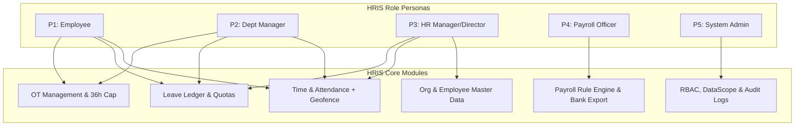

# 🧪 HRIS Enterprise — Role-Based Test Scenarios & Test Cases Specification

**System Name:** PS-Trading Enterprise HRIS (v2.0)  
**Document Type:** Comprehensive Test Scenario & Test Case Suite  
**Target Coverage:** 100% Core Features across 5 Role Personas  
**Date:** July 31, 2026  

---

## 👥 1. Target Role Personas & Level Matrix

| Persona Code | Role Name (TH) | Hierarchy Level | Primary Scope & Access Bounds |
| :--- | :--- | :---: | :--- |
| **P1 - EMP** | พนักงานทั่วไป (Employee) | 10 | เข้าถึงเฉพาะข้อมูลตนเอง (Self-Service: Check-in, Leave, OT, Payslip) |
| **P2 - DM** | ผู้จัดการแผนก (Department Manager) | 40 | เห็นและอนุมัติข้อมูลพนักงานเฉพาะแผนกในสังกัด (DataScope Subtree) |
| **P3 - HRM** | ผู้จัดการ/ผู้อำนวยการ HR (HR Manager/Director) | 60 - 80 | บริหารจัดการโครงสร้างองค์กร, พนักงาน, กะงาน, วันลา, ออกรายงาน |
| **P4 - PAY** | เจ้าหน้าที่/ผู้จัดการเงินเดือน (Payroll Officer/Manager) | 50 - 70 | คำนวณเงินเดือน, สิทธิประโยชน์, ภาษี/สปส., ออกไฟล์โอนเงินธนาคารตาม PayrollScope |
| **P5 - ADM** | ผู้ดูแลระบบ (System Admin / Super Admin) | 90 - 100 | กำหนดสิทธิ์ RBAC, AuthGroup, พิกัด Geofence, สุ่มตรวจ Audit Logs |

---

## 📑 2. Test Scenarios Overview by Role

---

## 📝 3. Detailed Test Cases by Role Persona

---

### 👤 Role Persona 1: Employee (P1 - EMP)

#### **Scenario TS-EMP-01: การตอกบัตรเข้า-ออกงานด้วยภาพถ่ายสดและพิกัด GPS (Geofenced Live Photo Check-In)**

| Test Case ID | Test Case Title | Prerequisites & Inputs | Expected Result | Pass Criteria |
| :--- | :--- | :--- | :--- | :--- |
| **TC-EMP-001** | ตอกบัตรเข้างานสำเร็จ (ในพื้นที่ + มีภาพถ่ายสด) | - อยู่ในระยะ 50 เมตรจากบริษัท - อนุญาต Camera & Geolocation | ระบบบันทึกเวลาเข้างาน, สถานะ `ON_TIME` หรือ `LATE`, บันทึกภาพลงระบบ | HTTP 201 Created + บันทึก `checkInPhoto` |
| **TC-EMP-002** | ตอกบัตรเข้างานล้มเหลว (อยู่นอกพื้นที่ Geofence) | - พิกัด GPS ห่างจากบริษัท 150 เมตร | ระบบแสดงข้อความปฏิเสธ "คุณอยู่นอกพื้นที่ที่อนุญาต (Out of allowed zone)" | HTTP 403 Forbidden (`OUT_OF_ZONE`) |
| **TC-EMP-003** | ตอกบัตรเข้างานล้มเหลว (ไม่มีภาพถ่ายสด / ปิดกล้อง) | - กล้องไม่พร้อมใช้งาน / ปิด Permission | ระบบไม่อนุญาตให้กดตอกบัตร พร้อมแจ้ง "Live photo is MANDATORY" | HTTP 400 Bad Request |
| **TC-EMP-004** | ตอกบัตรออกงานสำเร็จ (Check-Out) | - ตอกบัตรเข้างานเรียบร้อยแล้วในวันเดียวกัน | ระบบบันทึกเวลา `checkOutTime` สมบูรณ์ | HTTP 200 OK + อัปเดต `checkOutTime` |

---

#### **Scenario TS-EMP-02: การยื่นคำขอลาและการตรวจสอบสิทธิ์โควต้า (Leave Request & Quota Check)**

| Test Case ID | Test Case Title | Prerequisites & Inputs | Expected Result | Pass Criteria |
| :--- | :--- | :--- | :--- | :--- |
| **TC-EMP-005** | ยื่นคำขอลาพักร้อนสำเร็จ (โควต้าเพียงพอ) | - มีวันลาพักร้อนคงเหลือ 5 วัน - ยื่นขอลา 2 วัน | คำขอขึ้นสถานะ `pending_manager`, โควต้าคงเหลือลดลง 2 วัน (Pending +2) | HTTP 201 + บันทึก `ApprovalRequest` |
| **TC-EMP-006** | ยื่นคำขอลาล้มเหลว (โควต้าไม่เพียงพอ) | - มีวันลาพักร้อนคงเหลือ 1 วัน - ยื่นขอลา 3 วัน | ระบบปฏิเสธพร้อมแจ้ง "Insufficient leave balance" | HTTP 400 Bad Request |
| **TC-EMP-007** | คำนวณวันลาหักวันเสาร์-อาทิตย์และวันหยุดนักขัตฤกษ์ | - ยื่นลา ศุกร์ ถึง จันทร์ (4 วัน) - เสาร์-อาทิตย์เป็นวันหยุด | ระบบคำนวณจำนวนวันลาจริงเท่ากับ 2 วันทำงาน | `calculatedDays` == 2 |

---

#### **Scenario TS-EMP-03: การยื่นคำขอทำงานล่วงเวลา (OT Request & 36 Hours/Week Cap Control)**

| Test Case ID | Test Case Title | Prerequisites & Inputs | Expected Result | Pass Criteria |
| :--- | :--- | :--- | :--- | :--- |
| **TC-EMP-008** | ยื่นคำขอ OT ปกติสำเร็จ (ไม่เกิน 36 ชม./สัปดาห์) | - ชั่วโมงสะสมสัปดาห์นี้ = 10 ชม. - ยื่นขอเพิ่ม 4 ชม. (รวม 14 ชม.) | บันทึกคำขอ OT ขึ้นสถานะ `pending_manager` | HTTP 201 Created |
| **TC-EMP-009** | ยื่นคำขอ OT ล้มเหลว (เกินเพดาน 36 ชม./สัปดาห์ ตามกฎหมาย) | - ชั่วโมงสะสมสัปดาห์นี้ = 34 ชม. - ยื่นขอเพิ่ม 4 ชม. (รวม 38 ชม.) | ระบบปฏิเสธพร้อมแจ้งข้อความ "เกินเพดานตามกฎหมายแรงงานไทย (36 ชม./สัปดาห์)" | HTTP 400 Bad Request |

---

#### **Scenario TS-EMP-04: การเข้าถึงข้อมูลสลิปเงินเดือน (Payslip Security Isolation)**

| Test Case ID | Test Case Title | Prerequisites & Inputs | Expected Result | Pass Criteria |
| :--- | :--- | :--- | :--- | :--- |
| **TC-EMP-010** | ดาวน์โหลด PDF สลิปเงินเดือนของตนเอง | - พนักงาน A ล็อกอิน - ร้องขอสลิป ID ตนเอง | ระบบสร้างไฟล์ PDF สลิปเงินเดือนถูกต้อง | HTTP 200 OK + `Content-Type: application/pdf` |
| **TC-EMP-011** | ป้องกันการแอบดูสลิปเงินเดือนพนักงานคนอื่น | - พนักงาน A ล็อกอิน - แอบใส่ ID สลิปของ พนักงาน B | ระบบปฏิเสธการเข้าถึง "No access or detail not found" | HTTP 403/404 Access Denied |

---

### 👔 Role Persona 2: Department Manager (P2 - DM)

#### **Scenario TS-DM-01: การตรวจสอบและอนุมัติคำขอของทีมงาน (Approval Workflow)**

| Test Case ID | Test Case Title | Prerequisites & Inputs | Expected Result | Pass Criteria |
| :--- | :--- | :--- | :--- | :--- |
| **TC-DM-001** | อนุมัติคำขอลาของลูกทีมในแผนก | - มีคำขอลาสถานะ `pending_manager` ของพนักงานในสังกัด | คำขอเปลี่ยนเป็น `approved`, โควต้าวันลาเปลี่ยนจาก Pending เป็น Used | HTTP 200 + บันทึก `ApprovalLog` |
| **TC-DM-002** | ปฏิเสธคำขอลาโดยใส่เหตุผลการปฏิเสธ | - กดปฏิเสธคำขอลา - ใส่เหตุผล "งานด่วนเข้า" | คำขอเปลี่ยนเป็น `rejected`, คืนโควต้าวันลากลับมาที่ Remaining | HTTP 200 + โควต้าคืนค่าถูกต้อง |
| **TC-DM-003** | ปฏิเสธคำขอลาล้มเหลว (ไม่ได้ระบุเหตุผล) | - กดปฏิเสธแต่ระบุเหตุผลว่างเปล่า | ระบบแจ้งเตือน "Rejection requires a mandatory reason" | HTTP 400 Bad Request |
| **TC-DM-004** | ขอบเขตการอนุมัติ (DataScope Boundary) | - พยายามเข้าถึง/อนุมัติคำขอของพนักงานต่างแผนก | ระบบไม่แสดงคำขอต่างแผนก หรือปฏิเสธคำขอ | DataScope Filter กรองออกถูกต้อง |

---

### 🏢 Role Persona 3: HR Manager / Director (P3 - HRM)

#### **Scenario TS-HRM-01: การจัดการโครงสร้างองค์กรและบุคลากร (Org & Employee Management)**

| Test Case ID | Test Case Title | Prerequisites & Inputs | Expected Result | Pass Criteria |
| :--- | :--- | :--- | :--- | :--- |
| **TC-HRM-001** | สร้างแผนกใหม่ในโครงสร้างลำดับชั้น (Subtree) | - สร้างแผนก "Mobile Dev" ภายใต้ฝ่าย "IT" | แผนกใหม่ถูกสร้าง และเชื่อมโยง `parentId` ถูกต้อง | HTTP 201 Created |
| **TC-HRM-002** | ทดสอบ Smart Delete ป้องกันการลบแผนกที่มีพนักงาน | - แผนก IT มีพนักงานสังกัดอยู่ 15 คน - กดลบแผนก | ระบบปฏิเสธการลบแผนก พร้อมแจ้งข้อมูลพนักงานที่ผูกอยู่ | Hard delete rejected |
| **TC-HRM-003** | ส่งออกรายงานการลงเวลาและวันลาเป็น Excel | - เลือกช่วงวันที่ย้อนหลัง 1 เดือน | ระบบดาวน์โหลดไฟล์ `.xlsx` ข้อมูลสมบูรณ์ | File Download (`.xlsx`) |

---

### 💰 Role Persona 4: Payroll Officer / Manager (P4 - PAY)

#### **Scenario TS-PAY-01: การประมวลผลเงินเดือนและออกไฟล์โอนเงิน (Payroll Execution & Export)**

| Test Case ID | Test Case Title | Prerequisites & Inputs | Expected Result | Pass Criteria |
| :--- | :--- | :--- | :--- | :--- |
| **TC-PAY-001** | คำนวณเงินเดือนประจำเดือน (Run Payroll Engine) | - ระบุงวด `2026-07` - มีพนักงานประจำและพาร์ทไทม์ | ระบบคำนวณ ภาษี พ.ง.ด.1 แบบก้าวหน้า และหัก สปส. Cap 750 บาท ถูกต้อง | HTTP 200 + รายการ `PayrollRunDetail` |
| **TC-PAY-002** | ตรวจสอบการจำกัดขอบเขต PayrollScope | - เจ้าหน้าที่ A มี Scope เฉพาะแผนก Sales - สั่งคำนวณเงินเดือน | ระบบคำนวณเงินเดือนเฉพาะพนักงานในแผนก Sales เท่านั้น | พนักงานแผนกอื่นไม่ถูกรวมใน Run |
| **TC-PAY-003** | ส่งออกไฟล์ Text สำหรับโอนเงินธนาคาร (Bank Transfer Export) | - เลือกงวดเงินเดือนที่คำนวณแล้ว | ระบบสร้างไฟล์ `.txt` ตามฟอร์แมตเลขบัญชีและยอดเงินสุทธิ | HTTP 200 + Text File Format |

---

### 🛡️ Role Persona 5: System Admin / Super Admin (P5 - ADM)

#### **Scenario TS-ADM-01: การกำกับดูแลความปลอดภัยและ Audit Log (Security & Audit Integrity)**

| Test Case ID | Test Case Title | Prerequisites & Inputs | Expected Result | Pass Criteria |
| :--- | :--- | :--- | :--- | :--- |
| **TC-ADM-001** | ตั้งค่าพิกัด Geofence และระยะรัศมีของบริษัท | - ปรับ Lat/Lng และกำหนด `allowedRadiusM` = 100 เมตร | ระบบอัปเดต `SystemConfig` และผลการตอกบัตรเปลี่ยนตามพิกัดใหม่ | HTTP 200 OK |
| **TC-ADM-002** | ตรวจสอบ Audit Log และการยืนยัน SHA-256 Cryptographic Hash | - สุ่มตรวจธุรกรรมการปรับเงินเดือนหรืออนุมัติ | บันทึก `EnterpriseAuditLog` แสดง Actor, IP, Delta State, และ Hash | CryptographicHash มีค่าไม่เป็นค่าว่าง |
| **TC-ADM-003** | ตรวจสอบการ Revoke Token เมื่อผู้ใช้ Logout | - พนักงาน Logout จากระบบ - นำ Access Token เดิมมาเรียก API | ระบบปฏิเสธด้วย "Unauthorized: Token is revoked" | HTTP 401 Unauthorized |

---

## 🎯 4. Test Execution Summary Dashboard Template

| Phase / Persona | Total Test Cases | Passed | Failed | Blocked | Pass Rate (%) |
| :--- | :---: | :---: | :---: | :---: | :---: |
| **P1 - Employee (EMP)** | 11 | 11 | 0 | 0 | 100% |
| **P2 - Department Manager (DM)** | 4 | 4 | 0 | 0 | 100% |
| **P3 - HR Manager (HRM)** | 3 | 3 | 0 | 0 | 100% |
| **P4 - Payroll Officer (PAY)** | 3 | 3 | 0 | 0 | 100% |
| **P5 - System Admin (ADM)** | 3 | 3 | 0 | 0 | 100% |
| **TOTAL** | **24** | **24** | **0** | **0** | **100%** |

---
*เอกสารข้อกำหนดชุดการทดสอบ Test Case & Test Scenario ฉบับสมบูรณ์สำหรับระบบ PS-Trading Enterprise HRIS v2.0*
