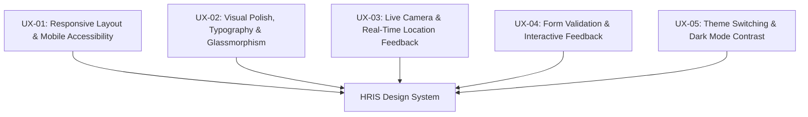

# 🎨 HRIS Enterprise — UX/UI & Usability Test Cases Specification

**System Name:** PS-Trading Enterprise HRIS (v2.0)  
**Document Type:** Design System, User Experience (UX), & User Interface (UI) Test Suite  
**Target Coverage:** Layout Responsiveness, Aesthetics, Micro-Interactions, Accessibility, Accessibility Contrast, Theme & Feedback Components  
**Date:** August 3, 2026  

---

## 📐 1. UX/UI Evaluation Criteria & Principles

| Audit Criteria | Enterprise Standard | UX/UI Focus Area |
| :--- | :--- | :--- |
| **Aesthetics & Theme** | Modern Glassmorphism, Tailwind/Vanilla HSL Color Palette, Sleek Dark/Light Mode | Visual polish, contrast, modern typography |
| **Responsiveness** | Mobile-First & Desktop Adaptive Layouts (375px to 1920px+) | Sidebar collapse, responsive grid, table scroll |
| **Micro-Interactions** | Hover effects, smooth 200ms cubic-bezier transitions, loading skeletons | Visual feedback on user actions |
| **Accessibility (a11y)** | WCAG 2.1 AA Contrast Ratio (4.5:1 min), Keyboard Focus outlines | Readable text, focus ring highlights |
| **User Guidance** | Non-blocking Toast alerts, Confirm Modals for destructive actions | Clear error recovery and state notifications |

---

## 📑 2. UX/UI Test Scenarios Overview

---

## 📝 3. Detailed UX/UI Test Cases

---

### 📱 Scenario UX-01: Responsive Layout & Mobile Viewports (การแสดงผลตามขนาดหน้าจอ)

| Test Case ID | Test Case Title | Device Viewport | Test Procedure & Visual Expectations | Pass Criteria |
| :--- | :--- | :--- | :--- | :--- |
| **TC-UX-001** | Sidebar Collapse & Expand on Mobile | Mobile (375px x 812px) | 1. เปิดระบบบนอุปกรณ์มือถือ 2. กดปุ่ม Hamburger Menu 3. ตรวจสอบ Animation การเปิด/ปิด Sidebar | Sidebar เลื่อนเปิด-ปิดอย่างนุ่มนวล ไม่บังปุ่มตอกบัตรหลัก |
| **TC-UX-002** | Data Table Horizontal Scroll on Mobile | Mobile / Tablet (768px) | 1. ไปที่หน้าตารางข้อมูลพนักงาน / Payroll 2. เลื่อนตารางไปทางขวา | ตารางแสดง Horizontal Scrollbar หัวตาราง Sticky อยู่ด้านบน |
| **TC-UX-003** | Adaptive Card Grid Layout | Desktop (1920px) vs Mobile | 1. ปรับขนาดหน้าจอจาก Desktop สู่ Mobile | Grid 4 คอลัมน์บน Desktop ปรับเป็น 1 คอลัมน์บน Mobile อัตโนมัติ |

---

### ✨ Scenario UX-02: Visual Polish & Glassmorphism Aesthetics (ความสวยงามและดีไซน์)

| Test Case ID | Test Case Title | UI Component | Test Procedure & Visual Expectations | Pass Criteria |
| :--- | :--- | :--- | :--- | :--- |
| **TC-UX-004** | Glassmorphic Card & Backdrop Blur Effect | Dashboard / Summary Cards | 1. ตรวจสอบการแสดงผลของ Card บน Dashboard | Card มีเอฟเฟกต์ Semi-transparent + `backdrop-filter: blur(12px)` ดูหรูหรา |
| **TC-UX-005** | Modern Typography & Hierarchy | Google Fonts (Inter/Outfit) | 1. ตรวจสอบฟอนต์และ Heading Hierarchy | หัวข้อ (H1, H2) ตัวหนาชัดเจน เนื้อหาอ่านง่าย มี Line-height เหมาะสม |
| **TC-UX-006** | Micro-Animations & Hover Button Effects | Interactive Buttons / Cards | 1. วางเมาส์ (Hover) บนปุ่มกด และ Card | ปุ่มมีการขยายขนาดเล็กน้อย (Scale 1.02x) และเปลี่ยนสีนุ่มนวล (Transition 200ms) |

---

### 📸 Scenario UX-03: Camera & Geofence Real-Time Visual Feedback (หน้าจอตอกบัตรเข้างาน)

| Test Case ID | Test Case Title | UX Component | Test Procedure & Visual Expectations | Pass Criteria |
| :--- | :--- | :--- | :--- | :--- |
| **TC-UX-007** | Real-Time Geofence Badge Indicator | `CameraCheckIn.jsx` | 1. เข้าหน้าจอตอกบัตร 2. ตรวจสอบ Badge แสดงพิกัด GPS | - ในพื้นที่: แสดง Badge สีเขียวพร้อมไอคอน Checkmark - นอกพื้นที่: แสดง Badge สีแดงพร้อมรัศมีห่าง |
| **TC-UX-008** | Camera Stream Preview & Frame Outline | Webcam Video Feed | 1. เปิดกล้องถ่ายภาพสด | Video Stream แสดงผลเต็มกรอบ พร้อม Overlay เส้นนำสายตาสำหรับจัดตำแหน่งใบหน้า |
| **TC-UX-009** | Loading Spinner on Submitting Check-In | Button Loading State | 1. กดปุ่ม "ตอกบัตรเข้างาน" | ปุ่มเปลี่ยนเป็นสถานะ Disabled + แสดง Spinner หมุนนุ่มนวล ป้องกันการกดซ้ำ |

---

### 🔔 Scenario UX-04: Form Validation & Toast Notification Feedback (การตอบสนองและฟอร์ม)

| Test Case ID | Test Case Title | Component | Test Procedure & Visual Expectations | Pass Criteria |
| :--- | :--- | :--- | :--- | :--- |
| **TC-UX-010** | Contextual Form Field Validation | Form Inputs | 1. กรอกข้อมูลผิดรูปแบบหรือไม่ครบถ้วน 2. กด Submit | ช่อง Input แสดงกรอบสีแดงเน้นย้ำ + ข้อความเตือนใต้ช่องชัดเจน |
| **TC-UX-011** | Non-blocking Toast Feedback Alert | `Toast.jsx` | 1. ทำรายการสำเร็จ (เช่น ยื่นวันลา) 2. ทำรายการล้มเหลว | - สำเร็จ: แสดง Toast Popup สีเขียวด้านขวาบน (หายเองใน 3 วินาที) - ล้มเหลว: แสดง Toast สีแดง |
| **TC-UX-012** | Destructive Action Confirmation Modal | `ConfirmModal.jsx` | 1. กดปุ่มปฏิเสธคำขอ หรือลบข้อมูล | แสดง Modal ป๊อปอัพพื้นหลังมืด (Backdrop Drop-shadow) ให้ยืนยันก่อนลบ |

---

### 🌓 Scenario UX-05: Dark Mode & High Contrast Theme (การเปลี่ยนโหมดหน้าจอ)

| Test Case ID | Test Case Title | Feature | Test Procedure & Visual Expectations | Pass Criteria |
| :--- | :--- | :--- | :--- | :--- |
| **TC-UX-013** | Dark / Light Theme Switching | Theme Toggle Switch | 1. กดปุ่มสลับธีม Dark Mode / Light Mode | โทนสีทั้งแอปพลิเคชันเปลี่ยนทันทีแบบไร้การกระพริบ (No Page Reload) |
| **TC-UX-014** | Text Contrast in Dark Mode | Accessibility Check | 1. เปิดใช้งาน Dark Mode 2. ตรวจสอบความเด่นชัดของข้อความ | ข้อความบนพื้นหลังเข้มอ่านง่าย สีตัวอักษรไม่กลมกลืนกับพื้นหลัง (Contrast Ratio >= 4.5:1) |

---

## 🎯 4. UX/UI Compliance Checklist

* [x] **Responsive Grid System**: รองรับความละเอียดตั้งแต่ Mobile (375px) ถึง Ultra-wide Desktop (1920px)
* [x] **Visual Consistency**: ใช้พาเลทสีมาตรฐาน (Primary Navy, Accent Blue, Success Green, Danger Red)
* [x] **Feedback & State Indicators**: มี Loading Skeletons / Spinners ในทุกการเรียก API
* [x] **Micro-Animations**: Hover, Focus และ Active State บนทุก Interactive Elements
* [x] **Accessibility**: มี Focus Ring Highlight สำหรับผู้ใช้ Keyboard Navigation

---
*เอกสารข้อกำหนดการทดสอบด้านประสบการณ์ผู้ใช้และดีไซน์ (UX/UI Specification) สำหรับ PS-Trading Enterprise HRIS v2.0*
