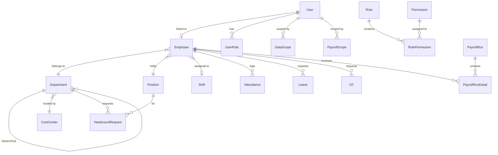

# HRIS Project: Comprehensive Technical Audit

This document provides a comprehensive technical audit of the current state of the Enterprise HRIS project, serving as the foundational context for future engineering tasks.

## 1. CURRENT DIRECTORY STRUCTURE

The project is structured as a logical monorepo with distinct frontend and backend applications, alongside extensive documentation.

```text
d:\Project\HRIS\
├── backend/                  # Node.js / Express Backend
│   ├── src/                  # Core business logic, API routes, controllers, and services
│   ├── prisma/               # Database schemas (schema.prisma), migrations, and seeds
│   ├── tests/                # Unit and Integration tests (Jest)
│   ├── coverage/             # Test coverage reports
│   ├── dist/                 # Compiled TypeScript output
│   ├── node_modules/
│   ├── .env                  # Backend environment variables
│   ├── docker-compose.yml    # Infrastructure definitions (likely Postgres/Redis)
│   ├── package.json          # Backend dependencies
│   └── tsconfig.json         # TypeScript configuration
├── hris/                     # Frontend Web App (React/Vite)
│   ├── src/                  # React components, contexts, hooks, and routing
│   ├── public/               # Static assets
│   ├── tests/                # UI Tests
│   ├── playwright-report/    # E2E Test reports
│   ├── test-results/         # Additional test outputs
│   ├── node_modules/
│   ├── index.html            # Vite entry point
│   ├── package.json          # Frontend dependencies
│   ├── vite.config.js        # Vite bundler configuration
│   └── eslint.config.js      # Linter configuration
├── docs/                     # Project documentation
└── *.md                      # Extensive architecture and sprint blueprints (e.g., Blueprint.md, ACCESS_CONTROL_DEEP_DIVE.md)
```

**Key Locations:**
*   **Core Business Logic & API Routes:** `backend/src/`
*   **Database Models:** `backend/prisma/schema.prisma`
*   **Frontend UI & Routing:** `hris/src/`

---

## 2. TECH STACK & INFRASTRUCTURE

### Frontend / API Gateway
*   **Framework:** React 19.2 (with React Router DOM)
*   **Build Tool:** Vite
*   **Charting / Visualization:** Recharts
*   **Network Requests:** Axios
*   **Real-time Communications:** Socket.io-client
*   **Document Generation:** JSPDF, HTML2Canvas
*   **E2E Testing:** Playwright

### Backend Runtime / Language
*   **Runtime:** Node.js
*   **Language:** TypeScript
*   **Web Framework:** Express 5.2.1
*   **Background Jobs:** BullMQ (running on Redis)
*   **Real-time Communications:** Socket.io
*   **Security:** speakeasy (MFA), bcrypt, express-rate-limit
*   **Document Generation:** PDFKit, ExcelJS
*   **Testing:** Jest, ts-jest

### Database & ORM / Query Builder
*   **Database:** PostgreSQL (using `pg` driver)
*   **ORM:** Prisma Client (v5.11.0)
*   **In-Memory Store / Cache:** Redis (used for caching and BullMQ)

### Authentication & External Services
*   **Authentication:** JWT (JSON Web Tokens) with a `RefreshToken` and `TokenBlacklist` implementation.
*   **MFA / 2FA:** Speakeasy (TOTP-based).
*   **Email Services:** Nodemailer.

---

## 3. CORE DATABASE SCHEMA / ENTITIES

The Prisma schema reveals a highly normalized, enterprise-grade architecture.



**Key Entities:**
*   **Identity & Access:** `User`, `Role`, `Permission`, `UserRole`, `AuthGroup`, `DataScope`, `PayrollScope`.
*   **Organization:** `Employee`, `Department` (hierarchical), `Position`, `CostCenter`.
*   **Time & Attendance:** `Shift`, `Attendance`, `AttendanceCorrection`, `Leave`, `OT`, `ShiftSwap`.
*   **Payroll:** `PayrollRun`, `PayrollRunDetail`, `PayrollComponent`, `PayrollComponentResult`.
*   **Workflows:** `ApprovalRequest`, `ApprovalLog`, `HeadcountRequest`.
*   **Auditing:** `AuditLog`, `EnterpriseAuditLog` (immutable with cryptographic hashes).

---

## 4. DESIGN PATTERNS & ARCHITECTURE

1.  **Modular Monorepo:** Distinct separation of concerns between the React frontend and the Express/Node backend.
2.  **Layered Backend Architecture (Inferred):**
    *   **Controllers:** Handling Express routing, request validation, and HTTP responses.
    *   **Services:** Housing complex business logic (e.g., payroll calculations, tree-traversal for departments).
    *   **Repository (Prisma):** Abstracting direct database interactions.
3.  **Advanced RBAC & ABAC:** 
    *   Role-Based Access Control via `Role` and `Permission`.
    *   Attribute-Based Access Control / Data Scoping via `DataScope` and `PayrollScope` to restrict data visibility (e.g., Managers only seeing their branch).
4.  **Workflow & State Machine Pattern:** Centralized `ApprovalRequest` and `ApprovalLog` tables for handling multi-step approvals (Leaves, OTs, Corrections, Headcounts).
5.  **Event-Driven / Async Processing:** Usage of BullMQ and Redis indicates background processing for heavy tasks like Payroll Generation or bulk email dispatch.
6.  **Immutable Audit Trails:** Use of `EnterpriseAuditLog` with cryptographic hashing for strict compliance and tracking AI-assisted actions.

---

## 5. EXISTING CONSTRAINTS & CONFIGURATION

*   **Environment Variables:** Managed via `.env` files (e.g., `DATABASE_URL` for PostgreSQL, JWT secrets).
*   **Database Connections:** Prisma relies on the `DATABASE_URL` environment variable for Postgres pooling. Redis configuration is likely passed to BullMQ directly in the backend code.
*   **Dynamic System Configuration:** Instead of relying purely on `.env` files for operational settings, a `SystemConfig` table exists in the database. This governs constraints like Geofencing parameters (`companyLat`, `companyLng`, `allowedRadiusM`) and `lateThresholdMins` for attendance dynamically without restarting the server.
*   **Local Development:** The project uses `docker-compose.yml` for standing up local infrastructure services like Postgres and Redis.
*   **Seeding & Bootstrapping:** Extensive seed scripts exist in `backend/prisma/` (e.g., `seed_company.js`, `seed_rbac.js`) and root folder scripts for initializing the application state.
