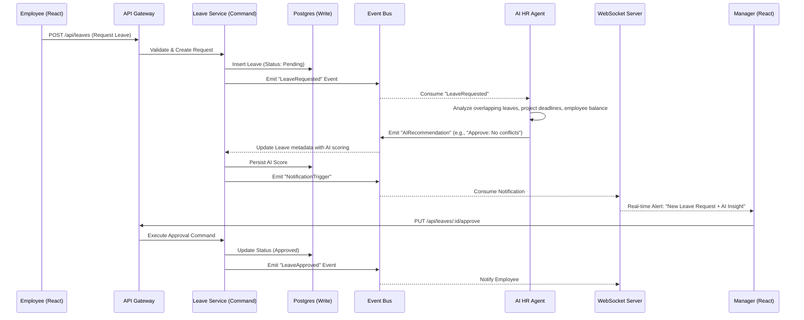

# HRIS Next-Gen Architecture Proposal: AI-Native Modular Enterprise System

This document outlines the architectural transformation of the legacy monolithic HRIS into a modular, AI-native platform designed for PS Trading. The architecture prioritizes **scalability, data integrity, strict access control, and asynchronous automation**.

---

## Task 1: System Blueprint & Modularization

To move beyond the constraints of a tightly coupled monolith, the system will adopt **Clean Architecture** principles wrapped within a **Domain-Driven Design (DDD)** methodology. This ensures business logic is entirely decoupled from the infrastructure and presentation layers.

### 1.1 Core Module Boundaries (Bounded Contexts)
The system is divided into isolated bounded contexts, each owning its domain logic and state:

*   **Identity & Access (IAM):** Handles Authentication (JWT, MFA, SAML/SSO), Role-Based Access Control (RBAC), and Data/Payroll scoping.
*   **Core Organization:** Manages the hierarchical structure (Regions, Branches, Departments), cost centers, positions, and employee profiles.
*   **Time & Attendance:** Ingests high-throughput clock-in/out data (geofenced), shift management, and handles correction workflows.
*   **Payroll & Compensation:** The most critical module. Consumes data from Attendance and Core Org to process earnings, deductions, tax calculations, and generate ledgers.
*   **Performance & Analytics:** Aggregates data for BI dashboards, KPIs, and reporting.
*   **Document Management:** Secure storage and retrieval of employee contracts, compliance documents, and payslips.

### 1.2 Modular Data Storage Strategy (Database per Domain)
Transitioning from a monolithic schema requires breaking down the unified database:
1.  **Logical Separation (Phase 1):** Implement bounded contexts at the code layer using distinct Prisma schemas or logical schema partitions within PostgreSQL. Cross-domain queries are strictly executed via internal API calls or service interfaces, not SQL joins.
2.  **Physical Separation (Phase 2):** Critical domains like **Time & Attendance** (high write volume) will migrate to a time-series or NoSQL store (e.g., MongoDB or TimescaleDB). **Payroll** will remain in a strict ACID-compliant relational database (PostgreSQL).
3.  **Eventual Consistency:** Data required across boundaries (e.g., an Employee's basic info needed by Payroll) is replicated via an **Event Bus** (e.g., Apache Kafka or RabbitMQ) using the outbox pattern.

---

## Task 2: Technical Stack & Performance

### 2.1 Recommended Production-Ready Stack
*   **API Gateway / BFF:** Node.js (NestJS) or Go. (NestJS enforces modularity out-of-the-box and supports CQRS and gRPC natively).
*   **Primary Database:** PostgreSQL 16+ (Advanced JSONB for dynamic scopes, robust ACID guarantees).
*   **Cache & Queue:** Redis (BullMQ for distributed task processing).
*   **Event Bus:** Apache Kafka (For inter-module asynchronous messaging and CQRS projections).
*   **Object Storage:** AWS S3 / MinIO (For Document Management, Payslip PDFs).
*   **Observability:** OpenTelemetry integrated with Prometheus (Metrics), Grafana (Dashboards), and ELK Stack (Log Aggregation).

### 2.2 API Layer & High-Concurrency Design
*   **CQRS (Command Query Responsibility Segregation):** The API splits operations. Read operations (Queries) hit Redis-backed read replicas optimized for fast retrieval. Write operations (Commands) are queued and processed asynchronously.
*   **gRPC for Internal Microservices:** While the external facing API uses REST/GraphQL for React clients, inter-module communication utilizes gRPC with Protocol Buffers for low latency, binary serialization, and strict type safety.
*   **Rate Limiting & Circuit Breaking:** The API Gateway implements token-bucket rate limiting and circuit breakers to prevent cascading failures during traffic spikes (e.g., 9:00 AM clock-in surges).

### 2.3 Leave Approval Workflow (Event-Driven + AI Agent)



---

## Task 3: AI-Co-Pilot Integration Layer

The "Internal HR AI Agent" acts as a secure, intelligent layer operating alongside human actors. It requires robust context ingestion without violating data privacy.

### 3.1 Infrastructure & RAG Architecture
*   **Vector Database:** Qdrant or Pinecone stores embedded organizational policies, historical resolutions, and anonymized performance data.
*   **LLM Orchestration:** LangChain or LlamaIndex orchestrates queries.
*   **Execution Environment:** The AI Agent runs as a highly isolated microservice, only interacting with the HRIS via secure gRPC endpoints enforcing the same RBAC rules as human users.

### 3.2 Strict RBAC & Data Privacy for AI
AI must not hallucinate access to privileged data.
1.  **Scoped Context Injection:** When a manager asks the AI, "Who is eligible for a bonus?", the AI Service intercepts the prompt, retrieves the manager's `DataScope` and `PayrollScope` from the IAM module, and appends a hardcoded filter to its internal DB queries.
2.  **Data Masking:** PII (Personally Identifiable Information) is tokenized before being sent to the LLM (if using external APIs). Internal open-source models (e.g., Llama 3 running on-prem) process data natively but only receive pre-filtered datasets.

### 3.3 Audit Log Schema for RAG & Compliance

A highly structured audit log serves dual purposes: strict legal compliance and rich, chronological context for AI models to understand *why* decisions were made.

```prisma
model EnterpriseAuditLog {
  id              String   @id @default(uuid())
  timestamp       DateTime @default(now()) @index
  
  // Actor Information (Who)
  actorId         Int
  actorRoles      Json     // Snapshot of roles at the time
  actorIp         String
  
  // Action Context (What)
  module          String   // e.g., "payroll", "attendance"
  action          String   // e.g., "APPROVE_LEAVE", "ADJUST_SALARY"
  recordId        String   // Target entity ID
  
  // State Transformation (Delta)
  previousState   Json?    // Null for creations
  newState        Json?    // Null for deletions
  
  // AI & RAG Context
  aiAssisted      Boolean  @default(false)
  aiRecommendationId String? // Link to AI inference logs
  businessReason  String?  // Mandatory justification for high-risk actions
  
  // Security
  cryptographicHash String // SHA-256 hash of previous log + current data for immutability
}
```

### Technical Rationale for Audit Schema:
1.  **State Transformation (JSON Deltas):** Capturing `previousState` and `newState` allows the AI to perfectly reconstruct the timeline of an employee's lifecycle without executing expensive historical SQL queries.
2.  **CryptographicHash:** Creating a blockchain-like immutable ledger ensures that if the database is compromised, tampering with audit logs becomes computationally impossible without breaking the chain.
3.  **AI Metadata:** Tracking `aiAssisted` and `businessReason` allows continuous fine-tuning of the AI model. We can evaluate scenarios where human managers rejected an AI's recommendation to improve future inference logic.
